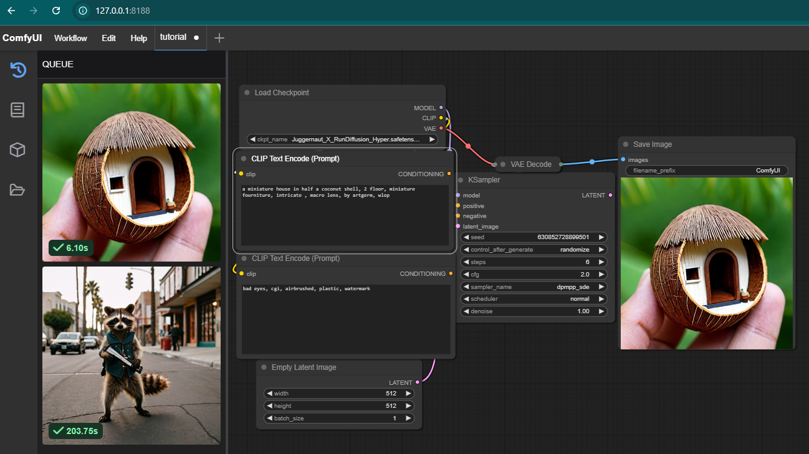
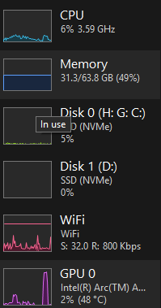

# ComfyUI Intel GPU

ComfyUI is a user-friendly interface for interacting with stable diffusion models, built using PyTorch and Docker. This project provides a convenient way to work with stable diffusion models, leveraging the performance of Intel GPUs.

## Requirements

* Intel GPU-based system (confirmed on ARC770 - 16GB)
* Windows Subsystem for Linux 2 (WSL2)
* Docker/Podman

## Usage

### Step 1: Update the `docker-compose-wsl2.yml` file

Before running ComfyUI, you need to update the `docker-compose-wsl2.yml` file to point to your own directories. Specifically, you need to update the `volumes` section to match your own file system.

Here's an example of what the `volumes` section might look like:

```yml
volumes:
  - /usr/lib/wsl:/usr/lib/wsl
  - /dev/dxg:/dev/dxg
  - /path/to/your/checkpoints:/ComfyUI/models/checkpoints
  - /path/to/your/custom_nodes:/ComfyUI/custom_nodes
  - /path/to/your/output:/ComfyUI/output
  - /path/to/your/user:/ComfyUI/user
```

Replace `/path/to/your/checkpoints`, `/path/to/your/custom_nodes`, `/path/to/your/output`, and `/path/to/your/user` with the actual paths to your own directories.

### Step 2: Run ComfyUI

Once you've updated the `docker-compose-wsl2.yml` file, you can run ComfyUI using the following command:

```bash
docker-compose -f docker-compose-wsl2.yml up
```
or 
```bash
podman-compose -f docker-compose-wsl2.yml up
```

This will start the ComfyUI container and make it available at `http://127.0.0.1:8188`.

## Note on First Run Performance
Please note that the first run of ComfyUI may take some time to load the model. This is because the model needs to be downloaded and loaded into memory. However, subsequent runs will be much faster, as the model will be cached.

Here's a screenshot of the first run performance (ARC770-16GB):



Additional Resources
* [ComfyUI GitHub Repository](https://github.com/comfyanonymous/ComfyUI/tree/master)
* [Discussion & Help](https://github.com/comfyanonymous/ComfyUI/discussions/476)
* [Intel Extension for PyTorch Installation Guide](https://pytorch-extension.intel.com/installation?platform=gpu&version=v2.5.10%2Bxpu&os=linux%2Fwsl2&package=pip)

# Verify
Run the below commands inside the container.
```
python -c "import torch; import intel_extension_for_pytorch as ipex; print(torch.__version__); print(ipex.__version__); [print(f'[{i}]: {torch.xpu.get_device_properties(i)}') for i in range(torch.xpu.device_count())];"
```

```
clinfo | grep "Device Name"

# EXAMPLE OUTPUT
  Device Name                                     Intel(R) Graphics [0x56a0]
    Device Name                                   Intel(R) Graphics [0x56a0]
    Device Name                                   Intel(R) Graphics [0x56a0]
    Device Name                                   Intel(R) Graphics [0x56a0]
```